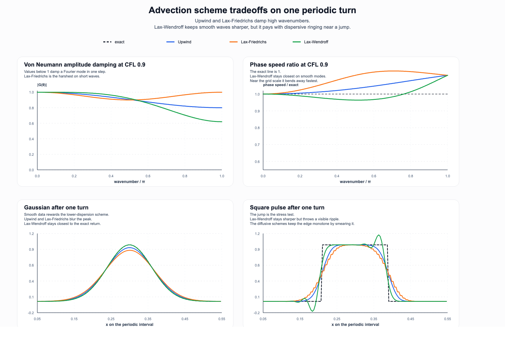
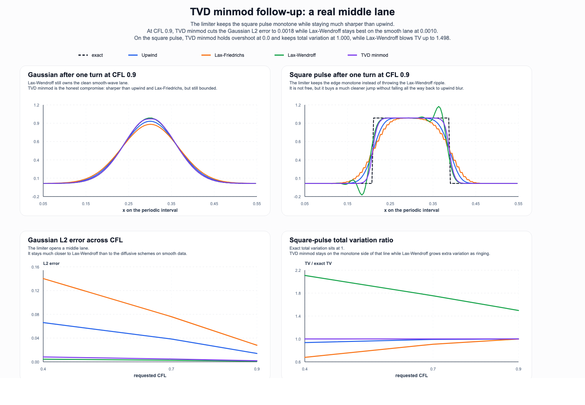
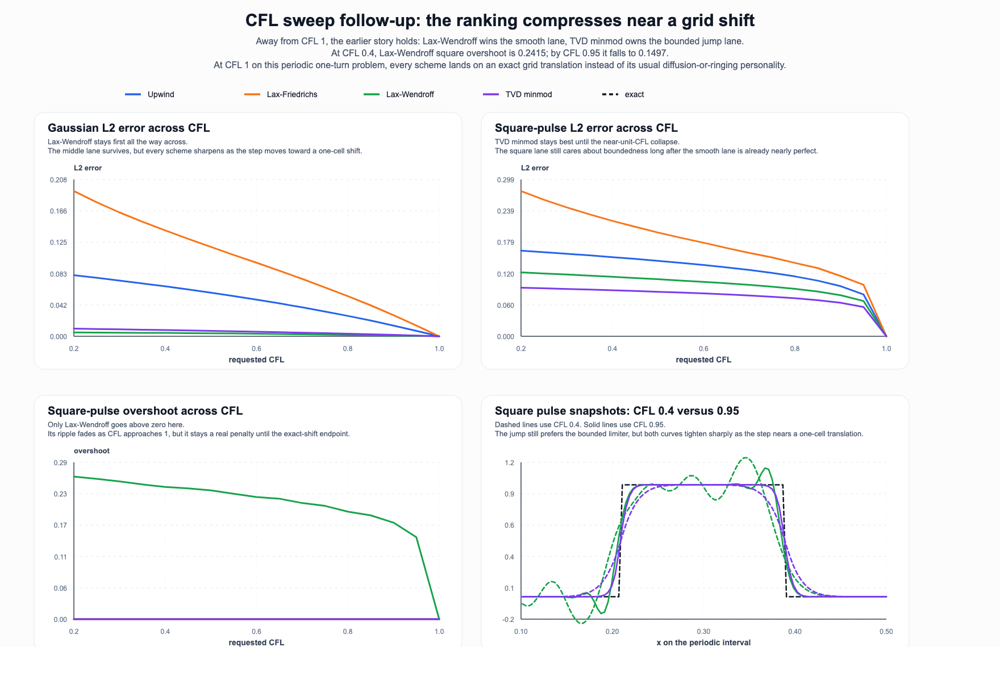
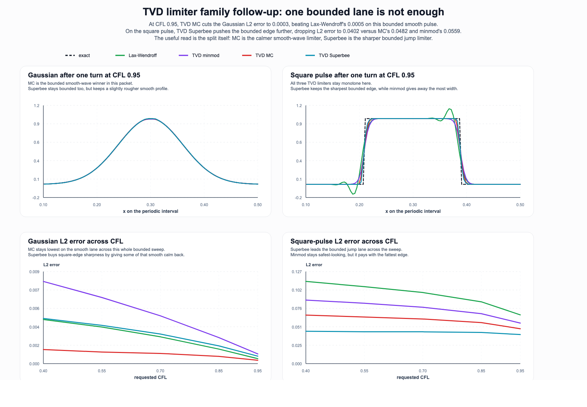
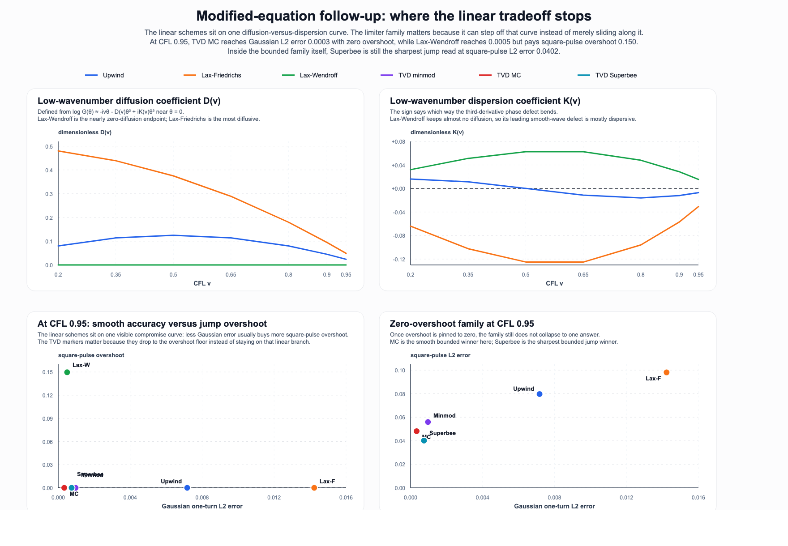

# advection-scheme-lab

Pure-Python experiments for one of the oldest numerical-analysis arguments around: if you transport a waveform across a grid, where do diffusion, dispersion, and monotonicity each win?



This repo opens with a tight first packet instead of a vague promise:

- a small simulation core for 1D linear advection on a periodic grid
- three classic schemes: upwind, Lax-Friedrichs, and Lax-Wendroff
- von Neumann amplitude and phase curves
- one-turn transport comparisons for a Gaussian pulse and a square pulse
- a generated SVG/PNG figure, CSV sidecar, report, notebook, and tests
- a TVD minmod follow-up that adds a real middle lane instead of pretending the choice is only blur versus ringing
- a CFL sweep follow-up that shows the old ranking compressing when the timestep itself becomes almost a pure grid shift
- a limiter-family follow-up that shows the bounded lane itself splitting into a smoother MC choice and a sharper Superbee choice
- a modified-equation follow-up that makes the linear diffusion-versus-dispersion tradeoff explicit and then shows why the bounded limiter family steps off that curve instead of merely sliding along it

## Thesis

No single finite-difference scheme wins every lane.

- **Upwind** is monotone and easy to trust, but it blurs structure.
- **Lax-Friedrichs** damps even harder, especially on short waves.
- **Lax-Wendroff** keeps smooth profiles sharper and phase-accurate longer, but it pays for that sharpness with visible ringing near a jump.

The limiter follow-up sharpens that reading instead of replacing it.

- **TVD minmod** keeps the square pulse monotone and much cleaner than Lax-Wendroff.
- It also stays much sharper than upwind on the Gaussian.

The limiter-family follow-up sharpens it again.

- **TVD MC** is the calmer bounded smooth-wave choice in this packet.
- **TVD Superbee** is the sharper bounded jump choice.
- So even the bounded lane is not one thing.

That tradeoff is the whole point of the repo. It turns a classroom slogan into something you can inspect, rerun, and extend.

## Quick start

```bash
python3 scripts/generate_gallery.py
python3 scripts/generate_limiter_followup.py
python3 -m unittest discover -s tests
python3 -m advectionlab.cli render-overview \
  --output assets/advection-scheme-tradeoffs.svg \
  --png-output assets/advection-scheme-tradeoffs.png
python3 -m advectionlab.cli write-csv --output assets/advection-scheme-transport.csv
python3 -m advectionlab.cli render-limiter-followup \
  --output assets/advection-minmod-limiter-followup.svg \
  --png-output assets/advection-minmod-limiter-followup.png
python3 -m advectionlab.cli write-limiter-csv --output assets/advection-minmod-limiter-followup.csv
python3 scripts/generate_cfl_sweep_followup.py
python3 -m advectionlab.cli render-cfl-sweep-followup \
  --output assets/advection-cfl-sweep-followup.svg \
  --png-output assets/advection-cfl-sweep-followup.png
python3 -m advectionlab.cli write-cfl-sweep-csv --output assets/advection-cfl-sweep-followup.csv
python3 scripts/generate_limiter_family_followup.py
python3 -m advectionlab.cli render-limiter-family-followup \
  --output assets/advection-limiter-family-followup.svg \
  --png-output assets/advection-limiter-family-followup.png \
  --cfl 0.95
python3 -m advectionlab.cli write-limiter-family-csv --output assets/advection-limiter-family-followup.csv
python3 scripts/generate_modified_equation_followup.py
python3 -m advectionlab.cli render-modified-equation-followup \
  --output assets/advection-modified-equation-followup.svg \
  --png-output assets/advection-modified-equation-followup.png \
  --focus-cfl 0.95
python3 -m advectionlab.cli write-modified-equation-csv --output assets/advection-modified-equation-followup.csv
```

## Repo layout

- `advectionlab/core.py` builds the periodic-grid simulation path
- `advectionlab/analysis.py` holds amplification factors, transport metrics, and the modified-equation coefficient study
- `advectionlab/render.py` renders the public figure as SVG
- `advectionlab/cli.py` exposes rebuild commands
- `scripts/generate_gallery.py` regenerates the figure, CSV, report, and notebook
- `scripts/generate_limiter_followup.py` regenerates the limiter follow-up figure, CSV, report, and notebook
- `scripts/generate_cfl_sweep_followup.py` regenerates the CFL sweep follow-up figure, CSV, report, and notebook
- `scripts/generate_limiter_family_followup.py` regenerates the limiter-family follow-up figure, CSV, report, and notebook
- `scripts/generate_modified_equation_followup.py` regenerates the modified-equation follow-up figure, CSV, report, and notebook
- `reports/linear-advection-scheme-tradeoffs.md` gives the first bounded read
- `notebooks/advection_scheme_tradeoffs.ipynb` is the companion notebook

## First artifact

The opening figure answers two different questions at once.

1. What does each scheme do to a Fourier mode in one step?
2. What does that choice look like after a full periodic transport of a smooth pulse and a sharp pulse?

The combined result is clean: Lax-Wendroff is the best smooth-wave lane in this first packet, but it is not a free upgrade because the square pulse shows the ripple immediately.

## Limiter follow-up



The follow-up packet adds one bounded escape hatch: a TVD minmod limiter.

It does something the opening three-scheme comparison could not:

- it keeps the jump monotone,
- it stays much sharper than upwind,
- and it makes the monotone-versus-sharp tradeoff feel like a real design curve instead of a binary choice.

The repo still does not pretend the limiter wins every lane. On the smooth Gaussian, unrestricted Lax-Wendroff remains best. That is why the follow-up earns its own artifact instead of silently replacing the first packet.

## CFL sweep follow-up



The next honest loophole is timestep geometry.

If the update moves toward a one-cell shift, the old ranking starts to compress.

- On the Gaussian, **Lax-Wendroff** still stays first.
- On the square pulse, **TVD minmod** still owns the bounded lane until the endpoint.
- But as CFL approaches 1 on this periodic one-turn problem, every scheme gets pulled toward the same exact grid-translation limit.

That does not erase the earlier tradeoff. It just puts a clean boundary around it: away from unit CFL, scheme personality dominates; near unit CFL, the step itself does more of the work.

## Limiter-family follow-up



The next loophole inside the bounded story is that "use a limiter" is still too vague.

This packet keeps the same one-turn periodic transport problem and changes only the limiter choice.

- **TVD MC** is the smooth bounded winner here.
- **TVD Superbee** is the sharp bounded jump winner here.
- **TVD minmod** still matters as the conservative baseline, but it is no longer the whole bounded story.

That is a better design read than a single "TVD" label. Once the repo enters the bounded family, the smooth lane and jump lane split again.

## Modified-equation follow-up



The next loophole after that is subtler.

Are the linear schemes and the limiter family all just different points on the same diffusion-versus-ringing tradeoff, or is the bounded family doing something qualitatively different?

This sidecar makes the linear smooth-wave story explicit through the low-wavenumber expansion

```text
log G(θ) ≈ -iνθ - D(ν)θ² + iK(ν)θ³
```

and then cashes it out against the one-turn transport errors.

- **Lax-Friedrichs** is the most diffusive linear lane.
- **Lax-Wendroff** is the near-zero-diffusion linear endpoint, so its price is mostly dispersive jump ringing.
- The TVD family matters because it steps off that linear compromise curve instead of merely sliding along it.
- Inside the zero-overshoot family, the split survives: **MC** is the smoother bounded choice and **Superbee** is the sharper bounded jump choice.

That makes the limiter-family result more than a scoreboard. It shows exactly where the old linear modified-equation story stops being the whole explanation.

## Why this repo is worth its own home

A lot of numerical-method repos either stop at derivations or stop at pretty plots. This one is meant to sit in the middle: simple enough to read in an evening, but concrete enough to make design choices visible.
